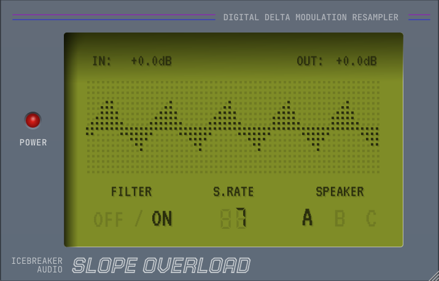

# Slope Overload
__A DPCM LoFi Plugin Effect__

## About The Effect

This is a rough emulation of the NES (Famicom) sample channel, which uses 1-bit delta modulation to store and reconstruct audio. Rather than storing each sample amplitude as a number, delta modulation only cares if the sample is higher (1) or lower (0) than the previous sample, and this is how we get away with only using 1-bit.

This method of digital sampling can actually yeld high quality audio with high enough sample rates (a variation on this technique was used for SACD). Naturally the NES had fairly low sample rates (with the highest around 33.1kHz). The audio chip supported 16 different sample rate settings for playback.

This form of digital lofi is slightly different from the usual PCM bitcrushers as it introduces a uniqure artifact:
```Slope Overload```

Because of how the encoding works, curves in the waveform get distorted into straight lines. So a sine wave would become a triangle wave.

## The Plugin



Out of the box __Slope Overload__ supports VST3, CLAP, LV2, and AU for both Windows, MacOS and Linux.

The UI uses 100% vector graphics and so can be resized freely.

In order to make the effect more usable, pre and post filters were added, as well as a gate which stops playback if the input audio is below the encoding threshold (without this you get a constant tone at the nyquist limit which is not unlike tinnitus).

I also added some small speaker impulse responses for added retro lofi nostalgia.

You can watch a little video example [here](https://youtu.be/ZvAPi2aBVWY).

## Dependancies

The effect was built using the [JUCE Framework](https://github.com/juce-framework/JUCE), which has been added to the git project as a submodule.
Likewise the CLAP format support is added using the [clap juce extensions](https://github.com/free-audio/clap-juce-extensions) library (also added as a submodule).
When JUCE officially support CLAP, I'll update that part of the codebase.

The UI uses two fonts which both have OLF licenses.

## Build

__Slope Overload__ can be built using CMake.
The CMake files were based off the [pamplejuce](https://github.com/sudara/pamplejuce) template, but simplified.

Personally I use [Visual Studio Code](https://code.visualstudio.com/) for working on and building the project, but you can also build from the terminal if you have CMake installed and set up for that.

## Install

Pre-built binaries are available [here](https://github.com/IcebreakerAudio/Slope-Overload/releases). You just need to place them in the correct directory (info is available on the release page).

Note that Apple have a very heavy-handed security system that will probably block the plugins from being used. You will need to update the MacOS security features to either allow unsigned files, or to exclude the plugin files (the method for how to do this changes now and again, so Google for the latest technique).

If you build the plugins yourself then you won't need to deal with the security stuff since you create the plugin binaries.
